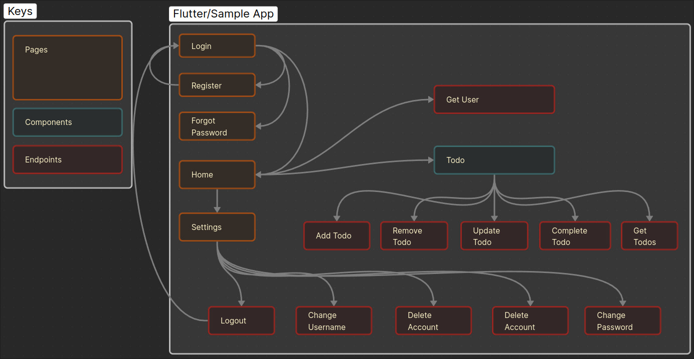

# Todo Application 

## Backend
### Cloud Requirements
- AWS RDS Database - storing data
- AWS EC2 Instance - for hosting server 
- Grafana - for online trace and logs aggregation

### Requirements
- Docker
- Git

### Server 
For the assignment I wrote the server in [Golang](https://pages.github.com/) with the [chi framework](https://go-chi.io/). The server connects to a [Postgres Database](https://www.postgresql.org/) and all logs and traces are sent to a [Grafana Instance](https://grafana.com/) to visualize for further use. The server is encapsulated using [Docker Compose](https://docs.docker.com/reference/compose-file/) and [Docker](https://docs.docker.com/) and finally a [reverse proxy  Caddy](https://caddyserver.com/) is used to reroute all traffic from the server to port :80. This allows the server to be horizontally scaled using [Docker Swarm](https://docs.docker.com/engine/swarm/) since it is a simple server.   


### Folder Structure
```
server/
├── conf
│   └── Caddyfile File
├── database
|	│   
│   └── scripts
│       └── Init scripts 
|     
├── docker-compose.yml
└── todo
    ├── Dockerfile                    - Server build file
    ├── internal                      - Entrance to server
	└── makefile                      - Make script to repetative cmds
       ├── api                        - Endpoints/Api 
       ├── cmd                        - App entrypoint
       ├── confs                      - Config files for all services 
       ├── database                   - Database functions
       ├── errors                     - Custom errors
       ├── logging                    - Global logger 
       ├── mailer                     - Mailer used to send emails
       ├── middlewares                - API Middleware
       ├── models                     - Models
       ├── otel                       - OTEL entrypoint
       ├── response                   - Custom server response templates
       ├── server                     - Server entrypoint
       └── utils                      - Miscellaneous functions
    
```


### Endpoints


To view and test endpoint, import [Todo server endpoints](https://github.com/crypticraccoon/nimble/blob/main/docs/Server.postman_collection.json) to postman. 

### How to build & deploy (local/cloud)

<details>

<summary>Local</summary>


- install docker 
- clone repo
- cp [.example.env](https://github.com/crypticraccoon/nimble/blob/main/server/.example.env) to .env and populate
- uncomment out data in docker-compose file to start local database 
- build and start server via docker compose  
- serve


</details>

<details>
<summary>AWS EC2 Instance + AWS RDS Database</summary>
 	- create a RDS Database - Postgres 17
 	- run [init script](https://github.com/crypticraccoon/nimble/blob/main/server/database/scripts/01-init.sql)to create tables
 	- update vpc settings to allow connections to database
 	- create AWS EC2 Instance 
 	- update vpc settings to allow connections to instance
 	- connect database to instance 
 	- install docker
 	- clone repo
 	- cp [.example.env](https://github.com/crypticraccoon/nimble/blob/main/server/.example.env) to .env and populate
 	- build and start server via docker compose  
	- server

</details>

## Front End 

For second part of the assignment I chose [flutter](https://flutter.dev/) as the framework. For this project I used the [MVVN Architecture](https://docs.flutter.dev/app-architecture/guide) which allows apps to be easier scaled, test, and maintained. 



### Requirements
Sdk Version -
ndk Version - 	27.0.12077973
Flutter Version - ^3.70
Gradle Version - 8.10.2

### Libraries
- [dio](https://pub.dev/packages/dio) - HTTP client & interceptor
- [flutter_secure_storage](https://pub.dev/packages/flutter_secure_storage) - for token
- [shared_preferences](https://pub.dev/packages/shared_preferences) - user data storage
- [go_router](https://pub.dev/packages/go_router) - app routing and deep linking
- [provider](https://pub.dev/packages/provider) - state management
- [json_annotations](https://pub.dev/packages/json_annotation) - generating models
- [freezed](https://pub.dev/packages/freezed) - generating models
- [intl](https://pub.dev/packages/intl) - localization 

### Folder structure
```
lib
├── config
│   └── provider.dart
├── data
│   ├── repositories
│   └── services
├── domain
│   └── models
├── l10n
│   └── app_en.arb
├── main.dart
├── router
├── ui
│   ├── auth
│   │   ├── login
│   │   │   ├── view_model
│   │   │   └── widgets
│   │   └── logout
│   ├── core
│   │   └── theme
│   ├── home
│   ├── recover
│   │   ├── recover
│   │   └── update
│   ├── registration
│   │   ├── newuser
│   │   └── registration
│   └── settings
│       ├── nav
│       └── settings
└── utils
```


## Roadmap
- Client 
	- [ ] asd
	- [ ] Finish folder structure 		
 	  
- Server
	- [ ] Explain auth flow
	- [ ] Include documentation that describes the setup process, architecture, and any external libraries or services used.
	- [ ] Provide a brief explanation of design decisions, especially around state management
